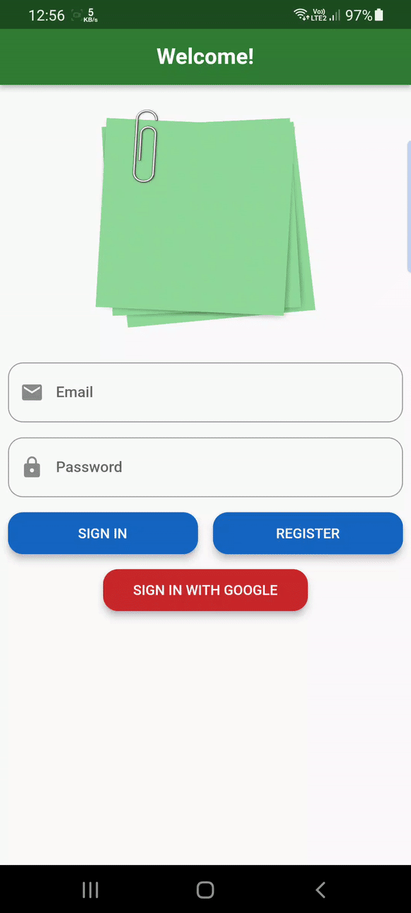

# Note_app_ddd 📝📒

Note is a mobile app both for Android and iOS made with Flutter. It was built using DDD as the architectural pattern, also Depending on Bloc as State Management.

Note is a mobile app for note-taking. Besides that, you can make To-Do lists inside each note. This is basically a dummy project that was intended to help me understand the Domain-Driven design. Nevertheless, the idea was also to build a nice UI to go along with the more technical aspect of the app.

Note uses Firebase as the back-end provider. Services such as Authentication and Firestore help the application to run as expected.

 

## 📱 Screen Shots 

     

## 🎥 Promo Video

  
  
  

## 🎯 Functionalities

✅ Create an account with your email and password (or you can choose to sign up with Google)

✅ Create a note

✅ Edit a note (the body or the color)

✅ Delete a note

✅ Add a To-Do to a note

✅ Edit a To-Do present inside a note (the name of the To-Do or if it is completed or not)

✅ Delete a To-Do present inside a note

✅ Change the order of the To-Dos

## 🔗 Reso Coder course:

https://resocoder.com/2020/03/09/flutter-firebase-ddd-course-1-domain-driven-design-principles/

 

## 🧑 Author

#### Ahmad Alzoabi

You can also follow my GitHub Profile to stay updated about my latest projects:

If you liked the repo then kindly support it by giving it a star ⭐!

Copyright (c) 2023 Ahmad Alzoabi

## Visitors Count

